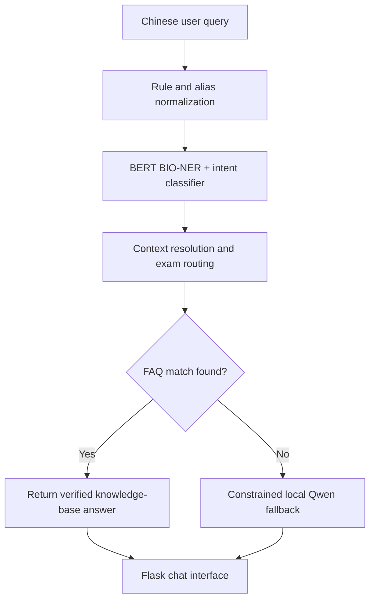

# Constraint-Aware BIO-NER Pipeline for Vertical-Domain Question Answering

A sanitized source release of a six-day industry prototype for Chinese exam-registration support. The system combines deterministic routing, BERT-based BIO entity recognition, intent classification, knowledge-base retrieval, conversational context, and a constrained local Qwen fallback.

The main design goal is to reduce hallucination in a high-precision information service: verified FAQ answers are preferred over free-form generation, and the language model is used only when deterministic retrieval cannot resolve a query.

## System architecture



## Core components

| Component | Implementation | Role |
|---|---|---|
| Entity recognition | Chinese BERT token classifier with BIO tags | Extracts exam, subject, time, action, constraint, and location information |
| Intent classification | TF-IDF bigrams + logistic regression | Identifies common intents such as registration time, entry point, login problems, and registration failures |
| Rule layer | Alias normalization and keyword-priority rules | Handles domain abbreviations, common phrasing, and high-confidence requests deterministically |
| Context handling | Previous-exam state | Resolves follow-up questions that omit the exam name |
| Retrieval | Exam-scoped FAQ filtering and question matching | Returns curated answers before invoking a generative model |
| Generative fallback | Local Qwen-1.8B model with constrained prompts | Produces a bounded response when the knowledge base has no direct match |
| Interface | Flask + AJAX chat page | Provides a lightweight browser-based prototype |

## Hallucination-control strategy

The response pipeline uses several safeguards:

1. deterministic rules and curated FAQ retrieval take priority over generation;
2. queries are routed to an exam-specific question set before matching;
3. the previous exam entity is retained only for eligible follow-up questions;
4. fallback prompts explicitly prohibit invented dates and URLs;
5. missing or unsupported information is surfaced as unavailable instead of being silently fabricated.

This is a prototype rather than a production guarantee. A generative fallback can still produce incorrect text and should not replace official information.

## Repository structure

```text
bio-ner-vertical-qa/
├── exam_chat_core/
│   ├── __init__.py
│   └── core_code.py                 # Integrated routing and QA pipeline
├── web/
│   └── web_app.py                   # Flask chat interface
├── 核心模型算法/
│   ├── BIO分词器.py                   # BIO dataset generation and BERT training
│   ├── 意图识别模型.py                # Intent-classifier training
│   ├── 自动生成提问.py                # Synthetic intent-data generation
│   ├── 模型测试.py                    # BIO model inference test
│   ├── Qwen接入.py                    # Local Qwen inference experiment
│   ├── 简单意图捕捉.py                # Zero-shot intent baseline
│   └── 接入Qwen及BIO后实际测试.py       # Earlier integrated prototype
├── requirements.txt
└── .gitignore
```

## Data and model policy

The repository intentionally excludes:

- business FAQ spreadsheets and other source documents;
- generated intent-training data;
- serialized classifiers and trained BERT checkpoints;
- Qwen model weights;
- virtual environments and local caches.

These artifacts are excluded to keep the release small and to avoid redistributing internal or third-party data. The checked-in code therefore documents the architecture and training workflow, but end-to-end execution requires locally supplied artifacts.

Expected local layout:

```text
bio-ner-vertical-qa/
├── exam_bio_final_model/            # Fine-tuned BERT model and tokenizer
├── faq_data/                         # Local .xlsx knowledge-base files
├── Qwen/                             # Local Qwen-1.8B model files
└── 核心模型算法/
    └── intent_model.pkl              # Trained intent classifier
```

The FAQ loader expects the first worksheet of each `.xlsx` file to include the columns `分类一`, `问题`, and `答案`.

## Environment

The prototype was developed with Python 3.10 and an NVIDIA CUDA environment. CPU execution is possible for the smaller components, but local Qwen inference is substantially more practical on a CUDA-capable GPU.

```bash
python -m venv .venv
source .venv/bin/activate
python -m pip install --upgrade pip
pip install -r requirements.txt
```

By default, the application looks for the local artifacts in the layout shown above. Custom paths can be supplied without editing the source:

```bash
export BIO_MODEL_PATH=/path/to/exam_bio_final_model
export FAQ_DATA_DIR=/path/to/faq_data
export INTENT_MODEL_PATH=/path/to/intent_model.pkl
export QWEN_MODEL_PATH=/path/to/Qwen
```

## Training workflow

Run commands from the repository root.

Generate synthetic intent examples and train the intent classifier:

```bash
python "核心模型算法/自动生成提问.py"
python "核心模型算法/意图识别模型.py"
```

Train the BIO token classifier:

```bash
python "核心模型算法/BIO分词器.py"
```

The included generators use template-based synthetic examples. For research-grade evaluation, replace or supplement them with independently annotated data and report entity-level precision, recall, and F1 on a held-out test set.

## Running the prototype

After supplying the local artifacts:

```bash
python web/web_app.py
```

Then open <http://127.0.0.1:5000>.

## Current status

This repository preserves an internship MVP and its experimental scripts. It is intended as a transparent portfolio and research artifact, not as a deployed public-information service. The private data and trained artifacts used during development are not part of this release, and no benchmark result is claimed without a reproducible evaluation set.
