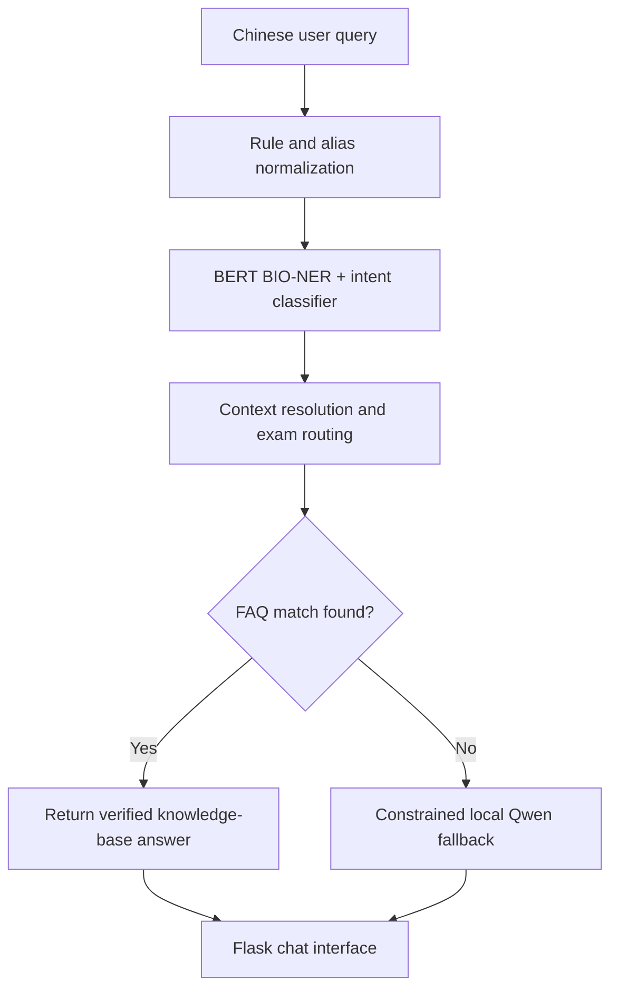

# Constraint-Aware BIO-NER Pipeline for Vertical-Domain Question Answering

A sanitized source release of a six-day industry prototype for Chinese exam-registration support. The system combines deterministic routing, BERT-based BIO entity recognition, intent classification, knowledge-base retrieval, conversational context, and a constrained local Qwen fallback.

The main design goal is to reduce hallucination in a high-precision information service: verified FAQ answers are preferred over free-form generation, and the language model is used only when deterministic retrieval cannot resolve a query.

## System architecture



## Core components

| Component | Implementation | Role |
|---|---|---|
| Entity recognition | Chinese BERT token classifier with BIO tags | Extracts exam, subject, time, action, constraint, and location information |
| Intent classification | TF-IDF bigrams + logistic regression | Identifies common intents such as registration time, entry point, login problems, and registration failures |
| Rule layer | Alias normalization and keyword-priority rules | Handles domain abbreviations, common phrasing, and high-confidence requests deterministically |
| Context handling | Previous-exam state | Resolves follow-up questions that omit the exam name |
| Retrieval | Exam-scoped FAQ filtering and question matching | Returns curated answers before invoking a generative model |
| Generative fallback | Local Qwen-1.8B model with constrained prompts | Produces a bounded response when the knowledge base has no direct match |
| Interface | Flask + AJAX chat page | Provides a lightweight browser-based prototype |

## Hallucination-control strategy

The response pipeline uses several safeguards:

1. deterministic rules and curated FAQ retrieval take priority over generation;
2. queries are routed to an exam-specific question set before matching;
3. the previous exam entity is retained only for eligible follow-up questions;
4. fallback prompts explicitly prohibit invented dates and URLs;
5. missing or unsupported information is surfaced as unavailable instead of being silently fabricated.

This is a prototype rather than a production guarantee. A generative fallback can still produce incorrect text and should not replace official information.

## Repository structure

```text
bio-ner-vertical-qa/
├── exam_chat_core/
│   ├── __init__.py
│   └── core_code.py                 # Integrated routing and QA pipeline
├── web/
│   └── web_app.py                   # Flask chat interface
├── experiments/
│   ├── train_bio_ner.py                  # BIO dataset generation and BERT training
│   ├── train_intent_classifier.py        # Intent-classifier training
│   ├── generate_intent_data.py           # Synthetic intent-data generation
│   ├── bio_model_inference_demo.py       # BIO model inference demo
│   ├── qwen_inference_demo.py            # Local Qwen inference experiment
│   ├── zero_shot_intent_baseline.py      # Zero-shot intent baseline
│   └── integrated_pipeline_prototype.py  # Earlier integrated prototype
├── requirements.txt
└── .gitignore
```

## Language conventions

Developer-facing documentation, comments, docstrings, diagnostics, and experiment logs are written in English. Chinese text is retained where it is part of the system's task definition: training utterances, exam aliases, intent labels, prompt templates, FAQ column names, example queries, and end-user interface copy. Translating those domain assets would change the behavior or evaluation target of this Chinese-language QA system.

## Data and model policy

The repository intentionally excludes:

- business FAQ spreadsheets and other source documents;
- generated intent-training data;
- serialized classifiers and trained BERT checkpoints;
- Qwen model weights;
- virtual environments and local caches.

These artifacts are excluded to keep the release small and to avoid redistributing internal or third-party data. The checked-in code therefore documents the architecture and training workflow, but end-to-end execution requires locally supplied artifacts.

Expected local layout:

```text
bio-ner-vertical-qa/
├── exam_bio_final_model/            # Fine-tuned BERT model and tokenizer
├── faq_data/                         # Local .xlsx knowledge-base files
├── Qwen/                             # Local Qwen-1.8B model files
└── experiments/
    └── intent_model.pkl              # Trained intent classifier
```

The FAQ loader expects the first worksheet of each `.xlsx` file to include the columns `分类一`, `问题`, and `答案`.

## Environment setup and local deployment

### 1. Prerequisites

- Git;
- Python 3.10 (the reference development version);
- enough local storage for the separately supplied model artifacts;
- an NVIDIA CUDA environment for faithful end-to-end Qwen inference.

The intent classifier, data utilities, and smaller BERT components can run on CPU. On Apple Silicon, PyTorch and the smaller components can be used where their dependencies support macOS, but the checked-in Qwen loading path was developed for CUDA and has not been validated as a Metal or MLX deployment.

### 2. Clone the repository

```bash
git clone https://github.com/Kathryn1206/bio-ner-vertical-qa.git
cd bio-ner-vertical-qa
```

### 3. Create an isolated Python environment

macOS or Linux:

```bash
python3.10 -m venv .venv
source .venv/bin/activate
python -m pip install --upgrade pip setuptools wheel
```

Windows PowerShell:

```powershell
py -3.10 -m venv .venv
.\.venv\Scripts\Activate.ps1
python -m pip install --upgrade pip setuptools wheel
```

If PowerShell blocks activation, allow it for the current process only:

```powershell
Set-ExecutionPolicy -Scope Process -ExecutionPolicy Bypass
```

### 4. Install PyTorch and project dependencies

For CPU or macOS development, install the dependency manifest directly:

```bash
pip install -r requirements.txt
```

For an NVIDIA machine, first use the [official PyTorch installation selector](https://pytorch.org/get-started/locally/) to install the build matching the operating system and CUDA runtime, then install the remaining dependencies:

```bash
pip install -r requirements.txt
```

The original internship environment was not preserved as a lockfile. `requirements.txt` records the required packages, while the bundled documentation of a locally supplied Qwen model should take priority if it requires a specific `transformers` version.

### 5. Supply the excluded artifacts

The default configuration expects this layout:

```text
bio-ner-vertical-qa/
├── exam_bio_final_model/
│   ├── config.json
│   ├── tokenizer_config.json
│   └── model weights
├── faq_data/
│   └── one_or_more_knowledge_bases.xlsx
├── Qwen/
│   └── local Qwen-1.8B model files
└── experiments/
    └── intent_model.pkl
```

Each FAQ workbook must contain the columns `分类一`, `问题`, and `答案` in its first worksheet. Private data, trained weights, and serialized models are not downloaded automatically.

### 6. Configure custom artifact paths

No configuration is needed when the default layout is used. Otherwise, set any of the following environment variables:

| Variable | Default | Purpose |
|---|---|---|
| `BIO_MODEL_PATH` | `./exam_bio_final_model` | Fine-tuned BIO-NER model and tokenizer |
| `FAQ_DATA_DIR` | `./faq_data` | Directory containing FAQ `.xlsx` files |
| `INTENT_MODEL_PATH` | `./experiments/intent_model.pkl` | Serialized intent classifier |
| `QWEN_MODEL_PATH` | `./Qwen` | Local Qwen model directory |
| `APP_HOST` | `127.0.0.1` | Flask development-server host |
| `APP_PORT` | `5000` | Flask development-server port |
| `FLASK_DEBUG` | `false` | Enables Flask debug mode only when set to `true` |
| `AUTO_OPEN_BROWSER` | `true` | Opens the local chat page after startup |

macOS or Linux example:

```bash
export BIO_MODEL_PATH=/absolute/path/to/exam_bio_final_model
export FAQ_DATA_DIR=/absolute/path/to/faq_data
export INTENT_MODEL_PATH=/absolute/path/to/intent_model.pkl
export QWEN_MODEL_PATH=/absolute/path/to/Qwen
```

Windows PowerShell example:

```powershell
$env:BIO_MODEL_PATH = "D:\models\exam_bio_final_model"
$env:FAQ_DATA_DIR = "D:\data\faq_data"
$env:INTENT_MODEL_PATH = "D:\models\intent_model.pkl"
$env:QWEN_MODEL_PATH = "D:\models\Qwen"
```

### 7. Validate the installation

Check the main imports and Python syntax:

```bash
python -c "import flask, joblib, numpy, openpyxl, pandas, sklearn, torch, transformers; print('Dependencies OK')"
python -m compileall -q exam_chat_core experiments web
```

Check the default artifact layout:

```bash
python -c "from pathlib import Path; required=['exam_bio_final_model','faq_data','Qwen','experiments/intent_model.pkl']; missing=[p for p in required if not Path(p).exists()]; assert not missing, f'Missing artifacts: {missing}'; print('Artifact layout OK')"
```

On an NVIDIA machine, verify that PyTorch can access CUDA:

```bash
python -c "import torch; print('CUDA available:', torch.cuda.is_available()); print('Device:', torch.cuda.get_device_name(0) if torch.cuda.is_available() else 'CPU')"
```

### 8. Start the local application

Run the command from the repository root:

```bash
python web/web_app.py
```

Model loading happens during startup and can take some time. Unless configured otherwise, the browser opens at <http://127.0.0.1:5000>.

With the application running, a macOS or Linux API smoke test is:

```bash
curl -X POST http://127.0.0.1:5000/api/chat \
  -H "Content-Type: application/json" \
  -d '{"question":"二建什么时候报名"}'
```

Windows PowerShell equivalent:

```powershell
Invoke-RestMethod -Method Post `
  -Uri "http://127.0.0.1:5000/api/chat" `
  -ContentType "application/json" `
  -Body '{"question":"二建什么时候报名"}'
```

### 9. Common setup problems

- **Model or tokenizer path not found:** confirm the artifact layout or print the four model/data environment variables.
- **No FAQ files loaded:** confirm that `FAQ_DATA_DIR` contains `.xlsx` files with the required column names.
- **`device_map` or Accelerate error:** reinstall the dependencies inside the active virtual environment and confirm that `accelerate` is importable.
- **CUDA is unavailable:** install a PyTorch build compatible with the installed driver by using the official selector; a system CUDA installation alone does not guarantee that the active PyTorch build supports CUDA.
- **Qwen custom-code incompatibility:** use the dependency versions documented with the supplied Qwen checkpoint.
- **macOS Qwen failure:** the repository does not claim a native MLX/MPS Qwen deployment; use the CUDA reference environment or adapt the fallback model separately.

The included Flask server is for local demonstration only. Do not expose its debugger or development server as a production service; Flask's [deployment documentation](https://flask.palletsprojects.com/en/stable/deploying/) recommends a dedicated WSGI server or hosting platform for production.

## Training workflow

Run commands from the repository root.

Generate synthetic intent examples and train the intent classifier:

```bash
python experiments/generate_intent_data.py
python experiments/train_intent_classifier.py
```

Train the BIO token classifier:

```bash
python experiments/train_bio_ner.py
```

The included generators use template-based synthetic examples. For research-grade evaluation, replace or supplement them with independently annotated data and report entity-level precision, recall, and F1 on a held-out test set.

## Current status

This repository preserves an internship MVP and its experimental scripts. It is intended as a transparent portfolio and research artifact, not as a deployed public-information service. The private data and trained artifacts used during development are not part of this release, and no benchmark result is claimed without a reproducible evaluation set.
